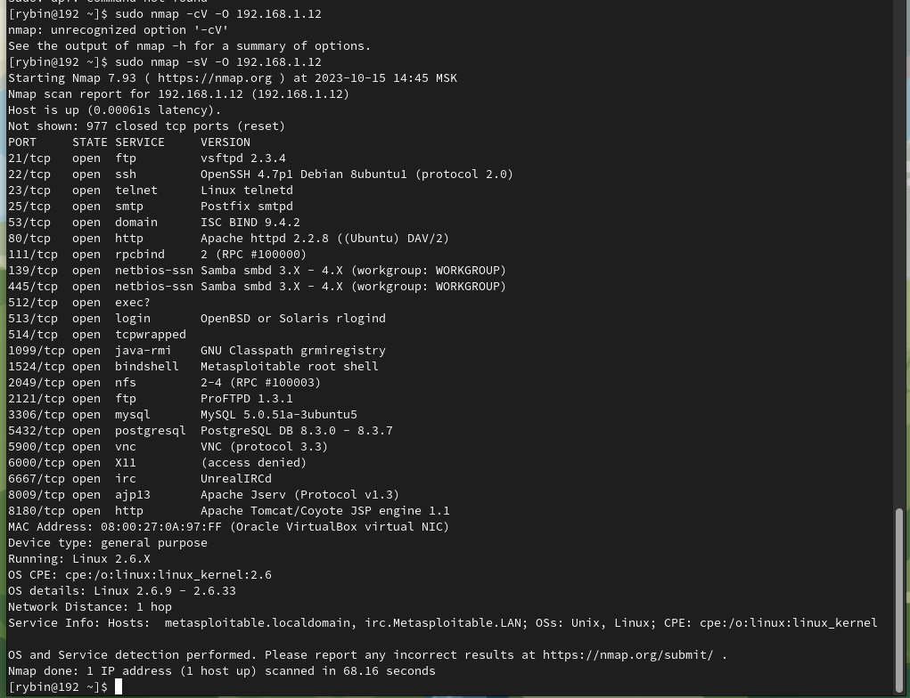

# hw_13_01_attacks

### Задание 1

977 портов закрытo, а разрешенные сетевые службы описаны на скриншоте:  

Найденные уязвимости:  
https://www.exploit-db.com/exploits/17491  
https://www.exploit-db.com/exploits/30020  
https://www.exploit-db.com/exploits/16922  

### Задание 2

1. SYN Scan — сканирование, которое основано на отправке пакетов, содержащих только один установленный флаг контроля соединения — SYN. Наличие флагов SYN|ACK в ответе указывает на то, что порт хоста открыт и прослушивается. Флаг RST в ответе означает обратное. Если Nmap принял пакет SYN|ACK, то в ответ немедленно отправляет RST-пакет для сброса еще не установленного соединения.
2. FIN scan — сканирование, которое основано на отправке пакетов, содержащих только один установленный флаг контроля соединения — FIN. Nmap посылает FIN-пакет, в TCP заголовок ставится флаг FIN. На такой FIN-пакет на закрытый порт хост должен ответить пакетом RST. FIN-пакеты на открытые порты должны игнорироваться хостом. По этому различию становится возможным отличить закрытый порт от открытого.
3. Xmas Scan — сканирование, которое основано на отправке пакетов, содержащих на каждый запрос разные флаги из всех доступных для контроля соединения. Сканирование Xmas получило свое название от набора флагов, которые включены в пакете. Эти сканирования предназначены для управления флагами PSH, URG и FIN заголовка TCP. При просмотре в Wireshark видно, что чередующиеся биты включены или «мигают», как если бы вы зажигали рождественскую елку.
4. UDP Scan - На каждый порт сканируемого хоста отправляется UDP-пакет без данных. Этот метод используется для определения, какие UDP-порты на сканируемом хосте являются открытыми. Если в ответ было получено ICMP-сообщение "порт недоступен", это означает, что порт закрыт. В противном случае предполагается, что сканируемый порт открыт.
